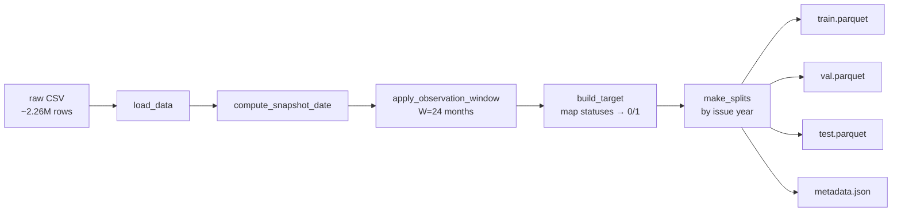

# Credit Risk Default Prediction System

<a target="_blank" href="https://cookiecutter-data-science.drivendata.org/">
    
</a>

An end-to-end credit risk default prediction system built on LendingClub loan data (2007–2016, ~1.3M loans after observation-window filtering). The goal is not just a model, but a defensible production system: principled temporal split, calibrated probabilities, FastAPI inference, drift monitoring, fairness audit, and honest documentation of what didn't work.

> **Status:** Currently: dataset construction and temporal splits. Next: data validation tests.

---

## What this project demonstrates

- **Temporal split with observation-window labeling.** Train on 2007–2014, validate on 2015, test on 2016. Observation window W = 24 months derived empirically from the cumulative months-to-default distribution.
- **Censoring bias diagnosed and corrected during EDA.** A naive labeling approach (dropping `Current` loans) inflated recent-vintage default rates by ~10 percentage points due to selection bias against still-paying long-term loans. See `references/data_card.md` (day-7) for the full discovery timeline and before/after evidence.
- **Reproducible pipeline.** Typer CLI, parquet caching, deterministic splits with `metadata.json` receipts. One command rebuilds the dataset.
- **More to come:** logistic regression / XGBoost / MLP comparison with stratified time-series CV, calibration analysis, business-cost threshold tuning, fairness audit, FastAPI inference, PSI drift monitoring, Streamlit ops dashboard. See `references/project_plan.md` for the full roadmap.

---

## Dataset construction

### The censoring bias problem

A naive labeling approach for this dataset — dropping loans in `Current`, `In Grace Period`, or `Late (16-30)` status and labeling all surviving rows by outcome — introduces severe censoring bias. Because the snapshot is taken at a fixed date (Dec 2018), loans not yet matured by that date are disproportionately likely to be in `Current` status. Dropping these rows *selectively removes the good loans*, since defaults tend to occur early in a loan's life while good loans simply continue paying. The result is a training distribution where recent vintages, especially 60-month loans, appear to default at extreme rates (~28%+) that are largely artifactual.

### Resolution: observation-window labeling

This project adopts an observation-window approach with W = 24 months. A loan is included iff `(snapshot_date − issue_d) ≥ W months`. Within that window:

- `Charged Off`, `Default`, `Late (31-120 days)`, and the corresponding policy-exception statuses → label 1
- `Fully Paid`, `Current`, and the corresponding policy-exception statuses → label 0
- `In Grace Period` and `Late (16-30 days)` → dropped (genuinely ambiguous, small row count)

Critically, `Current` loans that have cleared the 24-month observation window are labeled 0 rather than dropped. This makes dataset inclusion a function of issue date and the calendar — both independent of outcome — which eliminates the selection bias.

The cost is a bounded ~20% label noise on the positive class: some loans labeled 0 will eventually default after month 24 (slow defaulters). This is preferred over uncontrolled selection bias of unknown magnitude. The noise is symmetric across train/val/test, bounded by the empirical timing curve, and biased in the safe direction (slight under-estimation of default risk, which is calibratable at the threshold-tuning step).

W was chosen empirically from the cumulative distribution of months-to-default for charged-off loans:

| Months observed | % of defaults captured |
|-----------------|------------------------|
| 12              | ~25%                   |
| 18              | ~50%                   |
| 24              | ~80%                   |
| 30              | ~90%                   |
| 36              | ~95%                   |

W = 24 (~80% capture) was preferred over W = 30 (~90% capture) to preserve all of 2016 as test data. A larger W would have shrunk the test set to half a year, weakening the temporal-generalization signal.

### Resulting splits

| Split | Issue Years | Rows    | Default Rate |
|-------|-------------|---------|--------------|
| Train | 2007–2014   | 466,071 | 16.6%        |
| Val   | 2015        | 420,204 | 18.4%        |
| Test  | 2016        | 431,712 | 16.9%        |

The stability of default rates across splits — particularly train vs. test, within 0.3 percentage points — is empirical evidence that the censoring bias has been controlled. The slightly elevated val rate (2015) reflects LendingClub's underwriting expansion during that period and is consistent with the secular trend, not a methodology artifact.

Note: because LendingClub's loan volume grew exponentially between 2007 and 2018, the 8-year training window contains *fewer* rows than the 1-year val or 1-year test sets. This is a property of the data, not of the split design — earlier vintages contribute mostly varied macro conditions (2008–2010 recovery) rather than row count.

---

## How to reproduce

Clone the repo and set up the environment:

```bash
git clone https://github.com/Ak62007/Credit-Risk-Default-Prediction-System.git
cd Credit-Risk-Default-Prediction-System
uv sync
```

Download the LendingClub dataset from [Kaggle](https://www.kaggle.com/datasets/wordsforthewise/lending-club) and place `accepted_2007_to_2018q4.csv` in `data/raw/`.

Build the splits:

```bash
python -m credit_risk.dataset
```

This produces four files in `data/processed/`:
- `training_set.parquet`, `val_set.parquet`, `test_set.parquet` — the three splits
- `metadata.json` — a build receipt recording W, snapshot date, row counts, and class balance per split

Subsequent invocations are cached. Force a rebuild via the `--force-rebuild` flag.

Load the splits programmatically:

```python
from credit_risk.dataset import load_splits, PROCESSED_DATA_DIR
train_df, val_df, test_df, metadata = load_splits(PROCESSED_DATA_DIR)
```

---

## Architecture

Pipeline flow as of Milestone 3:



Future milestones will extend this with feature engineering (`features.py`), model training (`modeling/train.py`), inference (`modeling/predict.py`), and a FastAPI serving layer.

---

## Project organization

```
├── LICENSE
├── Makefile
├── README.md
├── data
│   ├── external       <- Data from third-party sources
│   ├── interim        <- Intermediate transformations
│   ├── processed      <- Final canonical datasets for modeling
│   └── raw            <- Original, immutable data dump
│
├── docs               <- mkdocs project
├── models             <- Trained and serialized models
├── notebooks          <- Jupyter notebooks (EDA, prototyping)
├── pyproject.toml     <- Project config and dependencies
├── references         <- Data card, project plan, manuals
├── reports
│   └── figures        <- Generated graphics
├── setup.cfg
│
└── credit_risk        <- Source code
    ├── __init__.py
    ├── config.py      <- Constants and paths
    ├── dataset.py     <- Data loading, observation-window filter, labeling, splits
    ├── features.py    <- (upcoming, Milestone 5)
    ├── modeling
    │   ├── __init__.py
    │   ├── predict.py <- (upcoming)
    │   └── train.py   <- (upcoming)
    └── plots.py
```

---

## References

- **Data card** — `references/data_card.md`. Day-by-day record of EDA findings, decisions, and the evolution of understanding throughout the project. Includes the full leakage column audit, status-by-status label mapping, and the censoring-bias discovery timeline.
- **Project plan** — `references/project_plan.md`. Full 23-milestone roadmap.
- **Dataset source** — [LendingClub data on Kaggle](https://www.kaggle.com/datasets/wordsforthewise/lending-club)

---

## License

See `LICENSE` file.