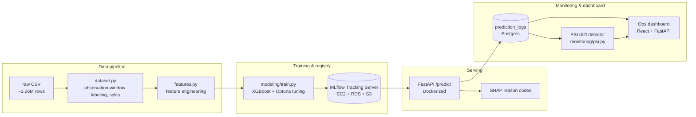
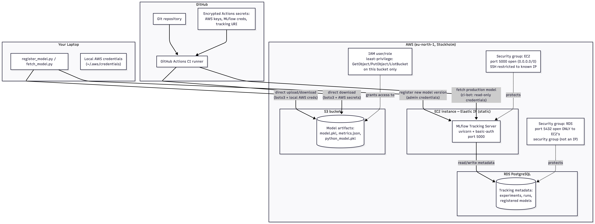
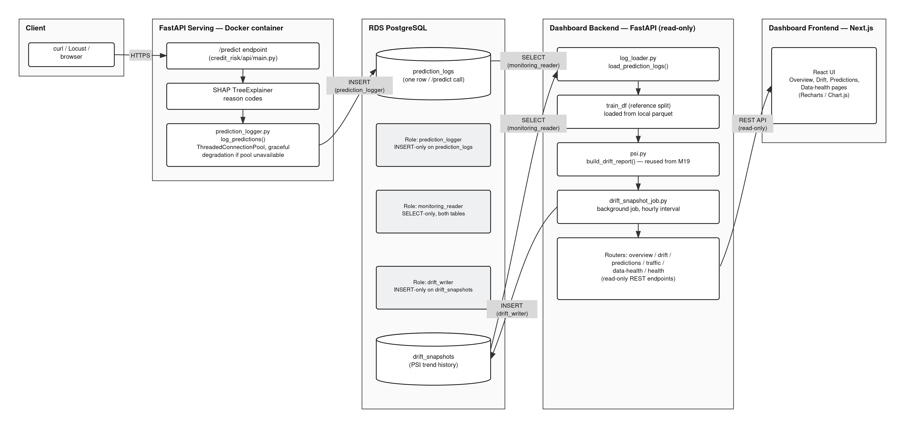

# Credit Risk Default Prediction System

<a target="_blank" href="https://cookiecutter-data-science.drivendata.org/">
    
</a>

An end-to-end credit risk default prediction system built on LendingClub loan data (2007–2016, ~1.3M loans after observation-window filtering). The goal is not just a model, but a defensible production system: principled temporal split, calibrated probabilities, FastAPI inference, drift monitoring, fairness audit, and honest documentation of what didn't work.

> **Status:** End-to-end and live (21 of 23 planned milestones complete): tuned XGBoost model, Dockerized FastAPI inference service, CI/CD via GitHub Actions, label-free PSI drift monitoring, a prediction-logging + ops dashboard, and this documentation pass all working together against a real Postgres/MLflow/S3 backend on AWS. Remaining: an honest "what didn't work" retrospective, and a v1.0 tag.

---

## What this project demonstrates

- **Temporal split with observation-window labeling.** Train on 2007–2014, validate on 2015, test on 2016. Observation window W = 24 months derived empirically from the cumulative months-to-default distribution.
- **Censoring bias diagnosed and corrected during EDA.** A naive labeling approach (dropping `Current` loans) inflated recent-vintage default rates by ~10 percentage points due to selection bias against still-paying long-term loans. See `references/data_card.md` (day-7) for the full discovery timeline and before/after evidence.
- **Model selection on operational grounds, not just raw metrics.** Logistic regression (0.301 test PR-AUC), tuned XGBoost (0.310, Optuna + time-series CV), and an MLP (0.305) all converge to the same ~0.30 PR-AUC ceiling — confirmed further by six separate feature-engineering experiments that each moved PR-AUC by less than 0.01. XGBoost was selected over the near-tied MLP specifically for SHAP-based interpretability (the regulator-accepted pattern for ECOA adverse-action-reason compliance), not benchmark-chasing on the 0.005 metric gap.
- **Two real findings, documented rather than glossed over.** Segmented error analysis found the model overpredicts default risk by 7.6 percentage points on LendingClub's Joint-application product — because Joint loans are entirely absent from the 2007–2014 training window, only arriving in 2015. Ranking still holds (ROC-AUC ~0.69 either way) but calibration silently breaks on a subpopulation the model never saw, exactly the blind spot M19's drift detector exists to catch. Separately, a fairness audit (income as a demographic proxy — no protected attributes exist in this dataset) found the model's false-positive rate for low-income borrowers is over 2x that of high-income borrowers, a tradeoff that's mathematically forced once you're calibrated across groups with different base rates (Chouldechova, 2017) — left undocumented-but-unfixed by deliberate, stated choice, not oversight.
- **Real inference service, not a notebook demo.** FastAPI serving with SHAP `TreeExplainer` reason codes, Dockerized (multi-stage build, dependency-group split cut the image from 10.6GB to 2.63GB), and load-tested with Locust — Uvicorn worker count was tuned from measured throughput/latency data, not guessed.
- **Production-pattern MLOps infra, self-hosted on AWS.** MLflow tracking server (EC2 + RDS Postgres + S3), least-privilege IAM/DB roles throughout, model registry with a Staging/Production promotion gate, and a GitHub Actions CI pipeline that pulls the registered production model before running tests.
- **Label-free drift monitoring.** A PSI covariate-shift detector covers all 65 features the model actually consumes (not a hand-picked watchlist), reusing the exact same function against both historical splits and live traffic. Real drift found and explained, not synthetic.
- **Prediction logging + a live ops dashboard.** Every `/predict` request is persisted to Postgres; a separate React/FastAPI dashboard surfaces drift trends, traffic, and prediction history read-only, on its own least-privilege DB credentials.
- **Honest documentation, not just a polished summary.** `references/data_card.md` is a day-by-day record of real findings, bugs, and decisions (including reversed ones) across the whole build — see the [full roadmap and progress](#references) below.

---

## Dataset construction

### The censoring bias problem

A naive labeling approach for this dataset — dropping loans in `Current`, `In Grace Period`, or `Late (16-30)` status and labeling all surviving rows by outcome — introduces severe censoring bias. Because the snapshot is taken at a fixed date (Dec 2018), loans not yet matured by that date are disproportionately likely to be in `Current` status. Dropping these rows *selectively removes the good loans*, since defaults tend to occur early in a loan's life while good loans simply continue paying. The result is a training distribution where recent vintages, especially 60-month loans, appear to default at extreme rates (~28%+) that are largely artifactual.

### Resolution: observation-window labeling

This project adopts an observation-window approach with W = 24 months. A loan is included iff `(snapshot_date − issue_d) ≥ W months`. Within that window:

- `Charged Off`, `Default`, `Late (31-120 days)`, and the corresponding policy-exception statuses → label 1
- `Fully Paid`, `Current`, and the corresponding policy-exception statuses → label 0
- `In Grace Period` and `Late (16-30 days)` → dropped (genuinely ambiguous, small row count)

Critically, `Current` loans that have cleared the 24-month observation window are labeled 0 rather than dropped. This makes dataset inclusion a function of issue date and the calendar — both independent of outcome — which eliminates the selection bias.

The cost is a bounded ~20% label noise on the positive class: some loans labeled 0 will eventually default after month 24 (slow defaulters). This is preferred over uncontrolled selection bias of unknown magnitude. The noise is symmetric across train/val/test, bounded by the empirical timing curve, and biased in the safe direction (slight under-estimation of default risk, which is calibratable at the threshold-tuning step).

W was chosen empirically from the cumulative distribution of months-to-default for charged-off loans:

| Months observed | % of defaults captured |
|-----------------|------------------------|
| 12              | ~25%                   |
| 18              | ~50%                   |
| 24              | ~80%                   |
| 30              | ~90%                   |
| 36              | ~95%                   |

W = 24 (~80% capture) was preferred over W = 30 (~90% capture) to preserve all of 2016 as test data. A larger W would have shrunk the test set to half a year, weakening the temporal-generalization signal.

### Resulting splits

| Split | Issue Years | Rows    | Default Rate |
|-------|-------------|---------|--------------|
| Train | 2007–2014   | 466,071 | 16.6%        |
| Val   | 2015        | 420,204 | 18.4%        |
| Test  | 2016        | 431,712 | 16.9%        |

The stability of default rates across splits — particularly train vs. test, within 0.3 percentage points — is empirical evidence that the censoring bias has been controlled. The slightly elevated val rate (2015) reflects LendingClub's underwriting expansion during that period and is consistent with the secular trend, not a methodology artifact.

Note: because LendingClub's loan volume grew exponentially between 2007 and 2018, the 8-year training window contains *fewer* rows than the 1-year val or 1-year test sets. This is a property of the data, not of the split design — earlier vintages contribute mostly varied macro conditions (2008–2010 recovery) rather than row count.

---

## How to reproduce

Clone the repo and set up the environment:

```bash
git clone https://github.com/Ak62007/Credit-Risk-Default-Prediction-System.git
cd Credit-Risk-Default-Prediction-System
uv sync
```

`uv sync` installs the `dev` dependency group by default (notebooks, training/tuning libraries) alongside the base serving dependencies — that's what you want if you're exploring the notebooks. For a lighter, serving-only install (what the Docker image itself uses), pass `uv sync --no-dev`.

Download the LendingClub dataset from [Kaggle](https://www.kaggle.com/datasets/wordsforthewise/lending-club) and place `accepted_2007_to_2018q4.csv` in `data/raw/`.

Build the splits:

```bash
python -m credit_risk.dataset
```

This produces four files in `data/processed/`:
- `training_set.parquet`, `val_set.parquet`, `test_set.parquet` — the three splits
- `metadata.json` — a build receipt recording W, snapshot date, row counts, and class balance per split

Subsequent invocations are cached. Force a rebuild via the `--force-rebuild` flag.

Load the splits programmatically:

```python
from credit_risk.dataset import load_splits, PROCESSED_DATA_DIR
train_df, val_df, test_df, metadata = load_splits(PROCESSED_DATA_DIR)
```

### Running the trained model

**Honest caveat before the commands below:** the trained model artifact (`models/tuned_xgb/model.pkl`) isn't published anywhere public — it's fetched at build/deploy time from this project's own private MLflow tracking server via `scripts/fetch_model.py`, which needs credentials only the author has. `modeling/train.py` is also still a deliberately untouched stub (see the data card for why). So cloning this repo alone doesn't get you a runnable model out of the box. To actually get one locally, either run the training notebooks yourself (`notebooks/11_XGboost_tuning.ipynb` onward reproduces the tuned XGBoost end to end against your own MLflow instance, local or remote), or treat the sections below as a description of how the system runs rather than a one-command reproduction.

With a model available locally, run the API directly:

```bash
uv run uvicorn credit_risk.api.main:app --reload
```

Or via Docker, which fetches the model from MLflow at build time (needs the five secrets `mlflow_tracking_uri`, `mlflow_username`, `mlflow_password`, `aws_access_key_id`, `aws_secret_access_key` — see the `RUN --mount=type=secret` block in the `Dockerfile`):

```bash
set -a; source .env; set +a
docker build \
  --secret id=mlflow_tracking_uri,env=MLFLOW_TRACKING_URI \
  --secret id=mlflow_username,env=MLFLOW_TRACKING_USERNAME \
  --secret id=mlflow_password,env=MLFLOW_TRACKING_PASSWORD \
  --secret id=aws_access_key_id,env=AWS_ACCESS_KEY_ID \
  --secret id=aws_secret_access_key,env=AWS_SECRET_ACCESS_KEY \
  -t credit-risk-api .
docker run -p 8000:8000 credit-risk-api
```

Either way, `POST /predict` with a payload matching `test_payload.json` returns a prediction, probability, and SHAP reason codes.

### Running the ops dashboard

The dashboard (`dashboard/`) is a separate FastAPI + Next.js app that reads `prediction_logs` read-only — see [`dashboard/README.md`](dashboard/README.md) for the two-process local setup. Like the model artifact above, this needs its own Postgres backend: the three least-privilege roles it depends on (`prediction_logger`, `monitoring_reader`, `drift_writer`) are defined in `scripts/sql/`, but provisioning the actual RDS/Postgres instance and running that DDL against it is on you if you're reproducing this outside the author's own AWS account.

---

## Architecture

High-level system flow, dataset build through live serving and monitoring:


```mermaid
flowchart LR
    subgraph Data[Data pipeline]
        A[raw CSV<br/>~2.26M rows] --> B[dataset.py<br/>observation-window labeling, splits]
        B --> C[features.py<br/>feature engineering]
    end

    subgraph Training[Training & registry]
        C --> D[modeling/train.py<br/>XGBoost + Optuna tuning]
        D --> E[(MLflow Tracking Server<br/>EC2 + RDS + S3)]
    end

    subgraph Serving[Serving]
        E --> F[FastAPI /predict<br/>Dockerized]
        F --> G[SHAP reason codes]
    end

    subgraph Monitoring[Monitoring & dashboard]
        F --> H[(prediction_logs<br/>Postgres)]
        H --> I[PSI drift detector<br/>monitoring/psi.py]
        H --> J[Ops dashboard<br/>React + FastAPI]
        I --> J
    end
```

Two more detailed diagrams cover specific slices of this system that don't fit cleanly into one flowchart.

**MLflow/CI infra** — how model artifacts and tracking metadata move between your laptop, GitHub Actions, and AWS (S3, EC2, RDS), including IAM roles and security groups. Built during M16.



**Serving & monitoring path** — the request-time flow from `/predict` through prediction logging, drift detection, and the dashboard, including the three least-privilege Postgres roles involved (`prediction_logger`, `monitoring_reader`, `drift_writer`). Built during M21.



---

## Project organization

```
├── .github/workflows
│   └── ci.yml           <- GitHub Actions: fetch production model from MLflow, run pytest
├── LICENSE
├── Makefile
├── README.md
├── Dockerfile             <- Multi-stage build, model fetched at build time (uv, dependency-group split)
├── locustfile.py          <- Load testing / demo-traffic generation against /predict
├── test_payload.json      <- Example valid RequestModel payload, used by locustfile.py and manual testing
│
├── data
│   ├── external       <- Data from third-party sources
│   ├── interim        <- Intermediate transformations
│   ├── processed      <- Final canonical datasets for modeling (train/val/test parquet + metadata.json)
│   └── raw            <- Original, immutable data dump
│
├── docs               <- mkdocs project
├── models             <- Trained/serialized models (git-ignored; fetched from MLflow/S3, see scripts/fetch_model.py)
├── notebooks          <- Jupyter notebooks — EDA, feature-engineering experiments, model selection, MLflow/SHAP/PSI prototyping
├── pyproject.toml     <- Project config and dependencies (uv, PEP 735 dependency groups: base vs. dev)
├── references
│   ├── data_card.md         <- Day-by-day record of findings/decisions across the whole build (M1-M20+)
│   ├── Column Glossary.md   <- Raw LendingClub column definitions
│   └── schema_for_mlflow.md
├── reports
│   ├── drift/drift_report.csv                        <- M19 PSI artifact (historical splits)
│   └── figures
│       ├── Full-CI-Architecture-DIagram.png           <- MLflow/S3/RDS/EC2/CI infra diagram (M16)
│       └── serving_monitoring_architecture.png        <- Serving + drift + dashboard diagram (M21)
├── scripts
│   ├── fetch_model.py     <- Pulls the Production-tagged model from MLflow at build/CI time
│   ├── register_model.py  <- Registers a trained model + promotes it in the MLflow registry
│   ├── inspect_artifacts.py
│   └── sql/                <- DDL for prediction_logs, drift_snapshots + least-privilege role grants
│
├── tests                  <- pytest: dataset/feature unit tests, API integration tests, PSI tests,
│                              prediction-logger/log-loader tests (all mock-based, no real DB required)
│
├── dashboard              <- Separate read-only ops dashboard, not part of the live serving path
│   ├── backend            <- FastAPI: routers (overview/drift/predictions/traffic/data-health/health),
│   │                          services (drift computation, drift-snapshot background job, caching)
│   └── frontend            <- Next.js/React UI (Recharts/Chart.js)
│
└── credit_risk            <- Source code for the core system
    ├── __init__.py
    ├── config.py          <- Constants, paths, env loading
    ├── dataset.py         <- Data loading, observation-window filter, labeling, splits
    ├── features.py        <- Feature engineering (shared by training and serving)
    ├── evaluation.py      <- Metrics, calibration, cost/threshold analysis
    ├── plots.py
    ├── utils.py
    ├── api
    │   ├── main.py        <- FastAPI app, /predict endpoint
    │   └── schemas.py     <- Pydantic request/response models
    ├── modeling
    │   ├── predict.py     <- Feature prep + inference + SHAP reason codes for a single request
    │   ├── train.py       <- Still the untouched cookiecutter stub (deferred; see data card)
    │   └── mlp.py          <- PyTorch MLP baseline (M12)
    └── monitoring
        ├── psi.py                <- Label-free PSI drift detector (M19)
        ├── prediction_logger.py  <- Writes every /predict request to Postgres (M20)
        └── log_loader.py         <- Reads prediction_logs back out for drift comparison (M20)
```

---

## References

- **Data card** — [`references/data_card.md`](references/data_card.md). Day-by-day record of findings, decisions, and reversed decisions across the whole build, not a polished-after-the-fact summary. Includes the full leakage column audit, the censoring-bias discovery timeline, and each milestone's design decisions, findings, and known limitations.
- **23-milestone roadmap** — tracked inside the data card rather than a separate plan document (an earlier `references/project_plan.md` was referenced in this README but never actually committed — removed rather than left dangling): dataset construction → EDA → temporal splits → validation tests → feature engineering → LR/XGBoost/MLP baselines → calibration → cost-based thresholds → segmented error analysis → fairness audit → MLflow tracking → FastAPI serving → Docker → CI/CD → load testing → PSI drift monitoring → prediction logging + dashboard → this documentation pass (done) → "what didn't work" retrospective → v1.0 release (remaining).
- **Column glossary** — [`references/Column Glossary.md`](<references/Column Glossary.md>). Raw LendingClub field definitions.
- **MLflow schema notes** — [`references/schema_for_mlflow.md`](references/schema_for_mlflow.md).
- **Dashboard** — [`dashboard/README.md`](dashboard/README.md). Setup and design notes specific to the ops dashboard.
- **Dataset source** — [LendingClub data on Kaggle](https://www.kaggle.com/datasets/wordsforthewise/lending-club)

---

## License

See `LICENSE` file.